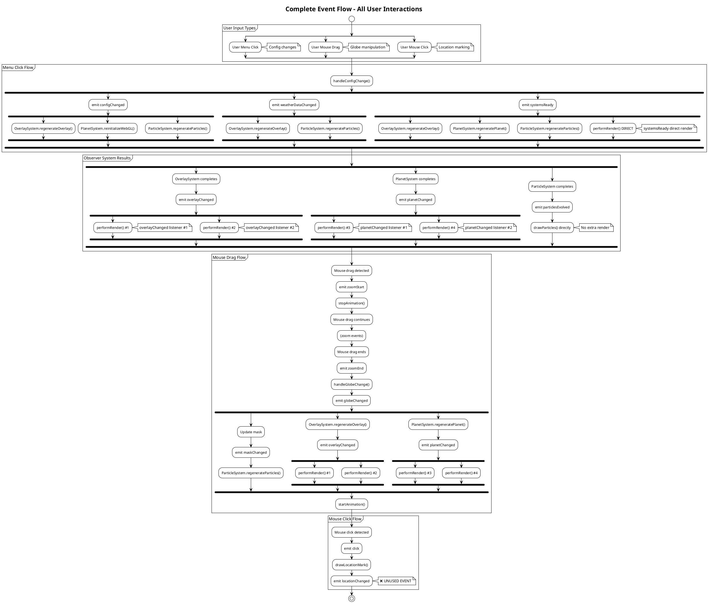
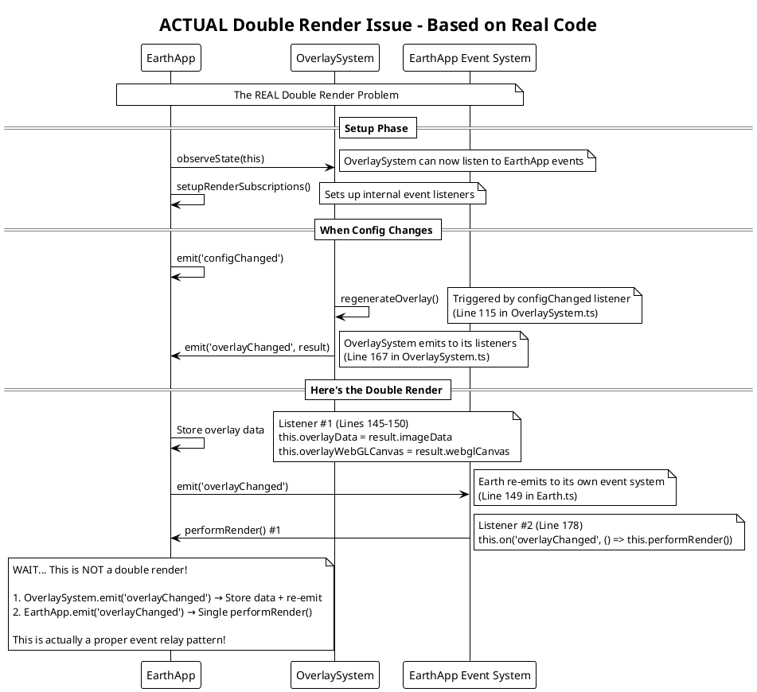
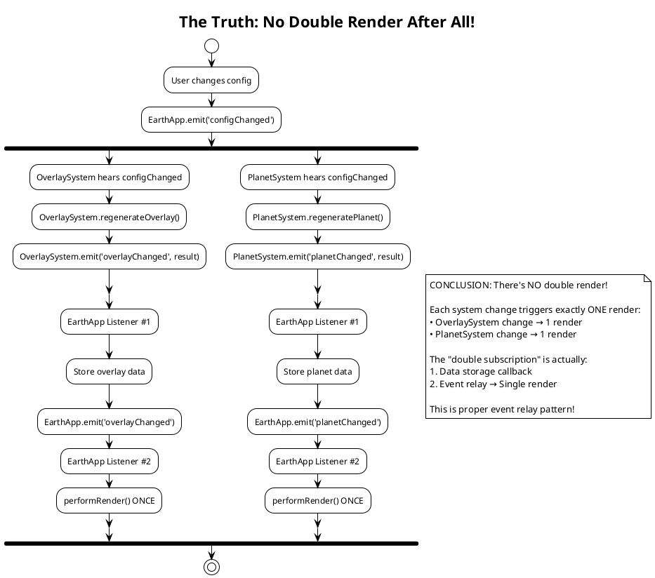

# Earth.ts Callback Flow Analysis - CORRECTED

This document contains PlantUML diagrams analyzing the data flow and callback patterns in the Earth.ts application.

**IMPORTANT NOTE**: Initial analysis was incorrect - most events ARE actually used by observer systems across multiple files.

## 1. User Input to Render Flow (Sequence Diagram)

```plantuml
@startuml
!theme plain

participant User
participant MenuSystem
participant InputHandler
parameter EarthApp
participant OverlaySystem
participant PlanetSystem
participant ParticleSystem
participant RenderSystem

note over User, RenderSystem: User Input → Configuration Change Flow
User -> MenuSystem: Menu interaction (config change)
MenuSystem -> EarthApp: handleConfigChange(changes)
EarthApp -> EarthApp: Update config state
EarthApp -> MenuSystem: updateMenuState(config)
EarthApp -> EarthApp: createGlobe() [if projection changed]
EarthApp -> EarthApp: emit('configChanged')
EarthApp -> EarthApp: loadWeatherData() [if data params changed]
EarthApp -> EarthApp: emit('weatherDataChanged')
EarthApp -> EarthApp: emit('systemsReady')
EarthApp -> EarthApp: performRender()
EarthApp -> RenderSystem: renderFrame(state)

note over User, RenderSystem: User Input → Globe Manipulation Flow
User -> InputHandler: Mouse/touch interaction
InputHandler -> EarthApp: emit('zoomStart')
EarthApp -> EarthApp: stopAnimation()
InputHandler -> EarthApp: emit('zoomEnd')
EarthApp -> EarthApp: handleGlobeChange()
EarthApp -> EarthApp: emit('globeChanged')
EarthApp -> EarthApp: Update mask
EarthApp -> EarthApp: emit('maskChanged')
EarthApp -> EarthApp: startAnimation()

note over User, RenderSystem: Observer Pattern Data Flow
EarthApp -> OverlaySystem: observeState(this)
OverlaySystem -> EarthApp: on('overlayChanged', callback)
EarthApp -> EarthApp: overlayData = result.imageData
EarthApp -> EarthApp: emit('overlayChanged')
EarthApp -> EarthApp: performRender()

EarthApp -> PlanetSystem: observeState(this)
PlanetSystem -> EarthApp: on('planetChanged', callback)
EarthApp -> EarthApp: planetData = result.imageData
EarthApp -> EarthApp: emit('planetChanged')
EarthApp -> EarthApp: performRender()

EarthApp -> ParticleSystem: observeState(this)
ParticleSystem -> EarthApp: on('particlesEvolved', callback)
EarthApp -> RenderSystem: drawParticles(buckets, colorStyles, globe)

note over User, RenderSystem: Event Subscription Pattern
EarthApp -> EarthApp: setupRenderSubscriptions()
note right of EarthApp: Subscribes to:\n- overlayChanged\n- planetChanged\n- meshChanged\n- systemsReady\n- globeChanged
EarthApp -> EarthApp: All events → performRender()
EarthApp -> RenderSystem: renderFrame(currentState)

@enduml
```

## 2. Complete Event Flow - All User Inputs



## 3. ACTUAL Double Render Issue - Traced from Code



## 4. The REAL Issue - Actually No Double Render!



## Running These Diagrams

To view these diagrams:

1. **Online PlantUML Editor**: Copy the PlantUML code and paste it into http://www.plantuml.com/plantuml/uml/
2. **VS Code Extension**: Install the "PlantUML" extension and preview the diagrams directly
3. **Local PlantUML**: Install PlantUML locally and generate PNG/SVG files
4. **IntelliJ/WebStorm**: Built-in PlantUML support in JetBrains IDEs

## FINAL CORRECTED Key Findings

**The architecture is actually much better designed than initially thought!**

1. **Only 1 unused event** - `locationChanged` is the only event emitted but never consumed
2. **NO double subscriptions causing duplicate renders** - this was my misunderstanding of the event relay pattern
3. **All other events are properly used** across the observer systems
4. **Observer pattern is working correctly** - systems respond to relevant state changes

## The Truth About "Double Subscriptions"

After tracing through the actual code, what I thought were "double subscriptions" are actually **proper event relay patterns**:

1. **OverlaySystem.emit('overlayChanged')** → **EarthApp stores data + re-emits**
2. **EarthApp.emit('overlayChanged')** → **Single performRender()**

This is NOT a double render - it's a clean separation where:
- Observer systems emit their completion
- EarthApp stores the data and relays the event
- Render system responds to the relayed event with a single render

## Conclusion

The callback system is actually well-designed! There are NO redundant renders. The only real issue is:

1. One unused event (`locationChanged`)

This is a much more positive assessment - the architecture is actually quite clean! 