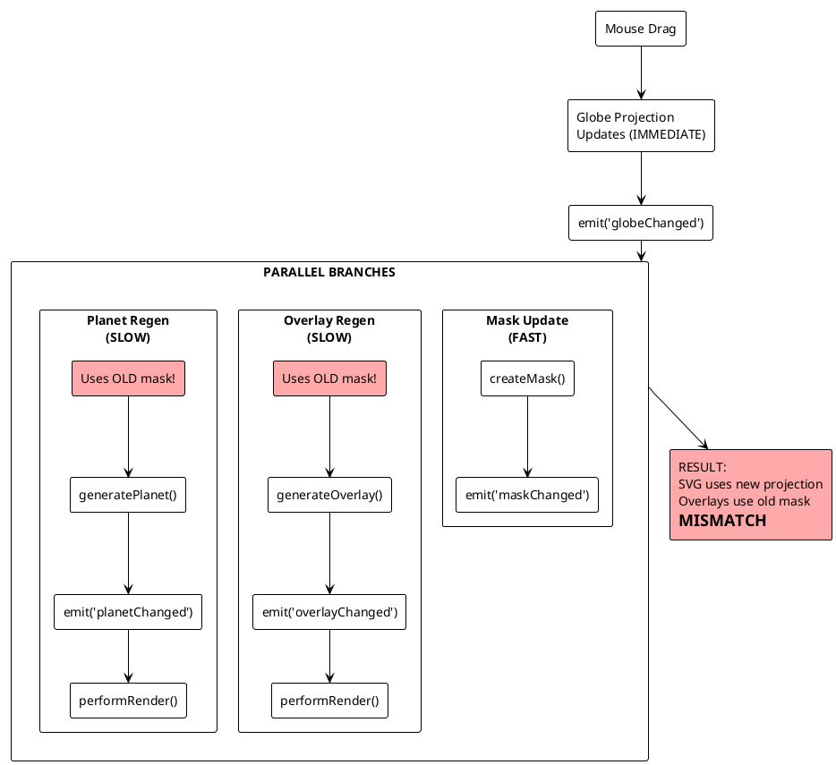
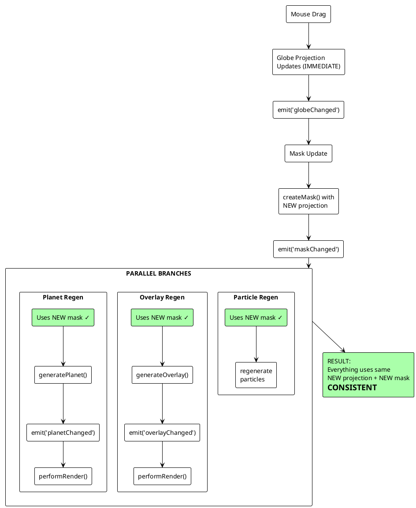

# Mouse Drag Flow - Block Diagram

## Current Problem Flow

## Fixed Flow

## The Fix

**Before:**
- OverlaySystem listens to `globeChanged` (uses old mask)
- PlanetSystem listens to `globeChanged` (uses old mask)

**After:**
- OverlaySystem listens to `maskChanged` (uses new mask)
- PlanetSystem listens to `maskChanged` (uses new mask) 